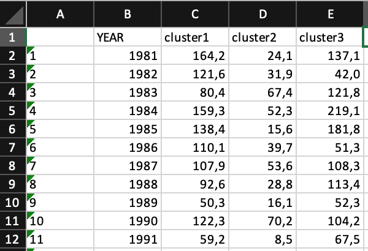
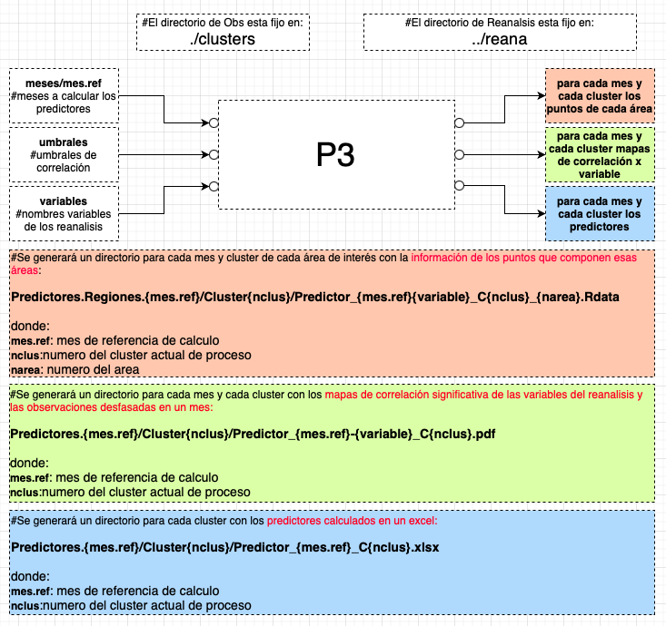
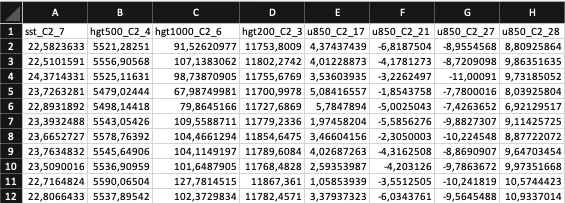
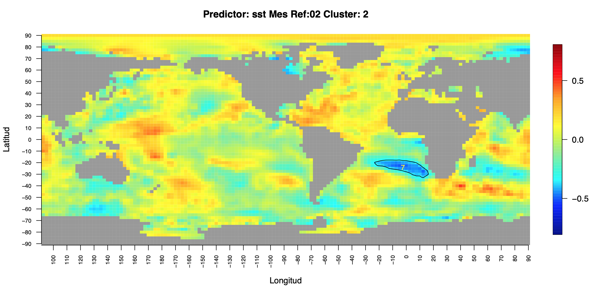

# Pronostico Probabilistico Estadistico (Machine Learning?) [paper](https://www.dropbox.com/s/akhc6kb6493c1rd/TAAC-D-21-00248.pdf?dl=0)
## Resumen

The “Gran Chaco Argentino” is an area with great diversity of vegetation and climate and its productivity is highly dependent on the interannual variability of rainfall. That is why the implementation of precipitation forecasts on monthly scales are important for decision makers in different areas such as agriculture, industry and power generation. Within the medium-scale forecasting methodologies are the statistical techniques that provide the possibility of learning from past situations to forecast future ones. Data mining techniques are currently a powerful tool to address these problems. In this work, neural networks, support vector regression and generalized additive models are considered besides the most commonly used multiple linear regression methodology, to obtain precipitation forecasting models. The results indicate that data mining techniques improve forecasts derived from other methodologies, although the efficiency of the different methodologies is highly dependent on the month and the region. In addition, the possibility of generating ensemble means of several models and deriving probabilistic forecasts is a highly advisable alternative for prediction in this region of Argentina.

## PASOS (Lenguaje R)
   - ## Preparación de las Observaciones
      * Deben estar dentro del directorio "clusters" en el directorio de trabajo
      * Deben estar contenidas en un archivo excel 
      * Tiene que haber un archivo excel por cada mes
      * Los archivos excel deben llamarse "series.medias.pre.{mes} donde {mes} es 01,02,...12  
      * Como se observa en la figura habra un columna para el año y una columna por cada cluster 
      * Ejemplo de excel con las observaciones de cada cluster
      * Cada columna se debe llamar "cluster1, cluster2, ... clusterN"

      

        
      

      
      :+1: Listo con este Paso !!!
  - ## Preparación de los Reanálisis
      * Los reanalisis deben estar en el directorio **nnr** (ncep-ncar-reanalisis)
      * Son reanalisis de NCEP-NCAR globales 
      * Cuya resolucion es de 144 puntos de longitud por 73 puntos de latitud
      * Esto implica que cubren reticulos de 250x250 Km2
      * La resolucion temporal es mensual
      * Es importante que inicien en el Enero del año 1979 **(aunque el periodo inical en el proceso debe ser 1980!)**
      * las variables de los reanalisis considerados son: 
         *  **hgt200**: geopotencial en 200 hPa
         *  **hgt500**: geopotencial en 200 hPa
         *  **hgt1000**: geopotencial en 1000 hPa,sst
         *  **sst**: temperatura superficie del mar
         *  **tcw**: agua total en la columna
      *  hay una variable que no cambia:
         * **lsm**: mascara de tierra y agua
      * (Explicar el script de descarga y preparacion de estos archivos)

     :+1: Listo con este Paso !!! 
      
   - ## Generación de predictores
      - ### Diagrama de funcionamiento

  

El objetivo de este programa es de obtener regiones cuya correlacion desfasada entre reanalisis y observaciones 
tenga un nivel de correlacion significativa y de ese modo obtener las series de predictores para que sirvan
de entrada al programa de generación de modelos, previa seleccion de aquellos predictores con sentido fisico, que aporten informacion a los modelos generados  

Importante: 
si queremos pronosticar febrero , correlacionamos los reanalisis de enero con las observaciones de febrero y guardamos los predictores en las planillas excel de febrero

Ejemplo de archivo excel de predictores:

  

Ejemplo de mapa de correlación:

  

      - **P3_Predictores.R** .  
     
         - [RESULTADOS](https://github.com/alrolla/Especializacion_2018/tree/master/Analisis_Exploratorio)
