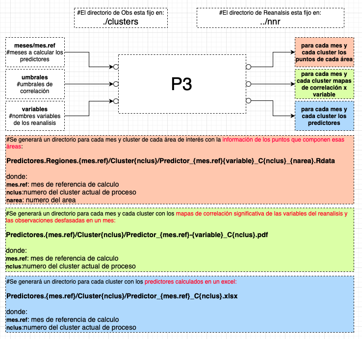
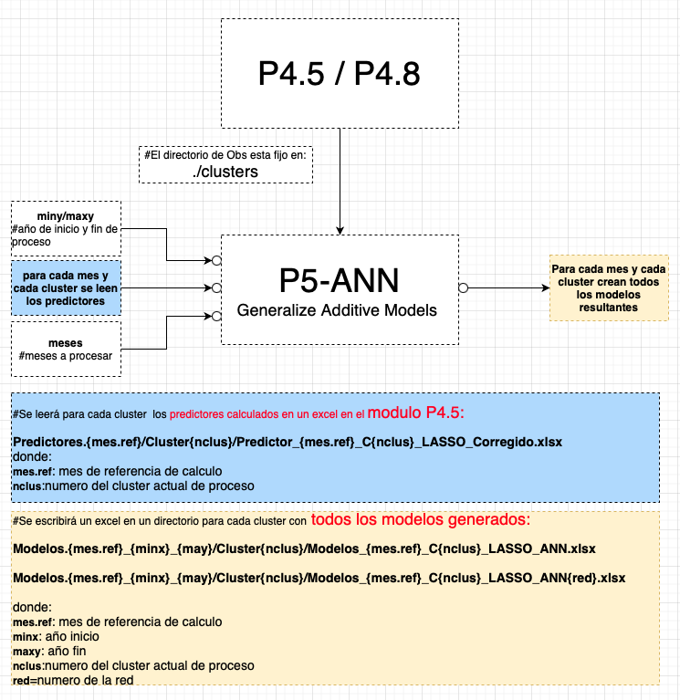

# Pronostico Probabilistico Estadistico (Machine Learning) 
## Resumen

Se describe la implementacion de un sistema para realizar un pronostico climático (trimestral - bimensual - mensual) en cualquier region de la que se tengan Observaciones provenientes de estaciones meteorologicas con registros largos utilizando reanalisis. La implementación de pronósticos de precipitación a escalas mensuales es importante para los tomadores de decisiones en diferentes áreas como la agricultura, la industria y la generación de energía. Dentro de las metodologías de pronóstico de mediana escala se encuentran las técnicas estadísticas que brindan la posibilidad de aprender de situaciones pasadas para pronosticar futuras. Las técnicas de minería de datos son actualmente una herramienta poderosa para abordar estos problemas. En este caso se consideran las redes neuronales, la regresión vectorial de soporte y los modelos aditivos generalizados, además de la metodología de regresión lineal múltiple más utilizada en el pasado, para obtener modelos de predicción de precipitaciones. Los resultados indican que las técnicas de minería de datos mejoran los pronósticos derivados de otras metodologías, aunque la eficiencia de las diferentes metodologías depende en gran medida del mes y la región. Además, la posibilidad de generar ensambles de varios modelos y derivar pronósticos probabilísticos es una alternativa muy recomendable para realizar el pronóstico que este sistema implementa.        

## Diagrama General 
La figura siguiente muestra la interaccion entre los distintos modulos del sistema de pronostico. 
* Todos los modulos fueron escritos en lenguaje R. 
* Los resultados/salidas en general se escribieron en formato excel. 
      

        

## MODULOS 
   - ## Preparación de las Observaciones
      * Deben estar dentro del directorio "clusters" en el directorio de trabajo
      * Deben estar contenidas en un archivo excel 
      * Tiene que haber un archivo excel por cada mes
      * Los archivos excel deben llamarse "series.medias.pre.{mes} donde {mes} es 01,02,...12  
      * Como se observa en la figura habra un columna para el año y una columna por cada cluster 
      * Ejemplo de excel con las observaciones de cada cluster
      * Cada columna se debe llamar "cluster1, cluster2, ... clusterN"

      

        
      

      
      :+1: Listo con este Paso !!!
  - ## Preparación de los Reanálisis
      * Los reanalisis deben estar en el directorio **nnr** (ncep-ncar-reanalisis)
      * Son reanalisis de NCEP-NCAR globales 
      * Cuya resolucion es de 144 puntos de longitud por 73 puntos de latitud
      * Esto implica que cubren reticulos de 250x250 Km2
      * La resolucion temporal es mensual
      * Es importante que inicien en el Enero del año 1979 **(aunque el periodo inical en el proceso debe ser 1980!)**
      * las variables de los reanalisis considerados son: 
         *  **hgt200**: geopotencial en 200 hPa
         *  **hgt500**: geopotencial en 200 hPa
         *  **hgt1000**: geopotencial en 1000 hPa,sst
         *  **sst**: temperatura superficie del mar
         *  **tcw**: agua total en la columna
      *  hay una variable que no cambia:
         * **lsm**: mascara de tierra y agua
      * (Explicar el script de descarga y preparacion de estos archivos)

     :+1: Listo con este Paso !!! 
      
   - ## P3-Generación de predictores
      - ### Diagrama de funcionamiento

  

El objetivo de este programa es de obtener regiones cuya correlacion desfasada entre reanalisis y observaciones 
tenga un nivel de correlacion significativa y de ese modo obtener las series de predictores para que sirvan
de entrada al programa de generación de modelos, previa seleccion de aquellos predictores con sentido fisico, que aporten informacion a los modelos generados  

Como se observa en el diagrama de funcionamiento las observaciones estan en el directorio **CLUSTERS** que es un lugar fijo dentro del programa P3 y los renanalisis estan en el directorio **NNR** que tambien es un lugar fijo. y generará mapas de correlacion y por otro lado excels con predictores para el mes considerado.

Importante: 
si queremos pronosticar febrero , correlacionamos los reanalisis de enero con las observaciones de febrero y guardamos los predictores en las planillas excel de febrero con estos predictores se generaran los modelos para febrero.

Ejemplo de archivo excel de predictores:

  

Ejemplo de mapa de correlación:

  

- ## P4-Reduccion de predictores  

* Este modulo prueba la independencia de los predictores
* Si son todos dependientes los deja a todos  

  

- ## P4.5 y P4.8 - Calculo de predictores siguiente año

* Cada vez que se usa este modulo se sobrescribe el resultado.  

  

- ## P5-RLM - Modelos de regresion lineal multiple 

  

A continuacion se muestra un ejemplo del excel de salida de regresion lineal multiple, se observa la columna de R^2 para este tipo de modelo. 

  

- ## P5-SVR - Support Vector Regression  

* Tener en cuenta que el modulo SVR puede tardar bastante  

  

A continuacion se muestra un ejemplo del excel de salida de SVR, se observa la columna de R^2 para este tipo de modelo. 

  

- ## P5-GAM - Modelos de Generalize Additive Models

  

A continuacion se muestra un ejemplo del excel de salida de GAM, se observa la columna de R^2 para este tipo de modelo. 

  

- ## P5-ANN - Modelos de Artificial Neural Networks

* ## Para poder usar este modulo es necesario instalar KERAS [Documentación](https://github.com/alrolla/PronProbaEst/blob/main/img/Instalacion%20Keras%20en%20R.docx)  

  

Este es esquema de las 4 arquitecturas de redes usadas.  

  

A continuacion se muestra un ejemplo del excel de salida de ANN, se observa la columna de R^2 para este tipo de modelo. 

  

- ## P7 - Pronóstico Probabilistico

  

Ejemplo de las distintas partes del Excel resultante del modulo P7   
Parte 1:  

  

 
 

* Se observa que 8 modelos superaron el umbral de 0.5 de R^2 ajustado
* Se ven los predictores que quedaron en las formulas de pronóstico
* solo entraron 3 de los cuatro tipos de modelos GAM, SVR, ANN el tipo RLM no genero modelos que superen el umbral de 0.5
* Se ve el pronostico y la observacion para verificar 
 

Parte 2:  

  

 

* La primer columna son los quintiles de las observaciones 
* La segunda columna La probabilidad "mayor que ..."
* La tercer columna el limite inferior
* La cuarta columna la probabilidad asosciada a cada umbral
 

Parte 3:  

  

* La primer columna son los quintiles de las observaciones 
* La segunda columna La probabilidad "entre quintiles ..."
* La tercer columna la probabilidad asociada
* La cuarta columna la OBSERVACION
* La quinta columna  el intervalo en que cae la observación
* la sexta columna  el intervalo en el que cae la mayor cantidad de modelos
* la septima columna IDX: el intervalo diferencia o error

Parte 4:  

  

* La primer columna es el tipo de modelo donde TOTAL es el ensamble medio
* La segunda columna es la cantidad de modelos usados
* La tercer columna es la media por tipo de modelo
* La cuarta columna es el desvio
* La ultima fila es el ensamble medio de los modelos

 

- ## P8 - Pronóstico Probabilistico operativo del proximo mes

- Este modulo es similar al Modulo P7 con la diferencia que como estamos pronosticando sin disponer de la observacion TODO lo relacionado a verificacion es omitido en el excel resultante  
- Antes de usar este modulo , se deben completar los archivos de predictores con el predictor del ultimo mes, pero calculado con los dias  hasta el momento de realizar el pronóstico. 
- Para ello, se tiene que usar el script "predicProno.sh {año}" para el año correspondiente ( ej: "predicProno.sh 2021"  en la maquina virtual Linux de VirtualBox. 

- ##  SCRIPT predicProno.sh :
- El script "predictprono.sh {año}" Creará el directorio NNRMes con los reanalisis de {hgt200.nc, hgt500.nc, hgt1000.nc, st.nc, tcw.nc, u850.nc,v850.nc}  de todos los meses de los dos ultimos años y el mes actual con los dias que tiene hasta el momento de realizar el pronóstico.  
- ### El contenido de ese directorio NNRMes hay que copiarlo en nuestra maquina Windows usando el directorio compartido Windows <-> Linux 
- En particular en el directorio NNRMes de la Maquina Windows  
- ### Una vez que lo copiamos correr el P4.8 para agregar los predictores del ultimo mes en el excel correspondiente.  

- ##  SCRIPT predictores.sh :
- Cada vez que termina un año , hay que usar el script "predictores.sh" en la maquina virtual, para tener los reanalisis completos en el  periodo de 1979 al año actual 
- ## Cambiar en el script predictores.sh cambiar la linea 69 con el año que hay que descargar    "for(( a=1979; a<= 2021 ; a++)); do" aca cambiar 2021 por el año que termino ej; 2022

- Este script crea el directorio NNR conteniendo los archivos de las variables de los reanalisis de todos los años 
- El contenido del directorio hay que copiarlo al directorio Windows "NNR"   

  

- ## P9 - Resumen de pronosticos probabilisticos para la verificación

Este modulo lee todos los pronosticos realizados para la verificación y arma un excel con 4 pestañas cada una conteniendo resumenes de los errores de todos los pronosticos.

  

- ## ANEXO - Instalacion de virtualbox y linux en Windows

  1. [Como instalar virtualbox y ubuntu?](https://osl.ugr.es/2020/09/29/como-instalar-ubuntu-en-virtual-box/)
  2. [Como configurar un directorio compartido ubuntu <-> windows ](https://docs.google.com/document/d/13T0DCI9fvo-ZCHFQTBwo9Act24s63QtKKufwGTDWIU4)

### Para facilitar el tema de la configuracion de la maquina virtual , luego de instalar virtualbox se puede importar la maquina virtual linux ya configurada  

  3. [Como exportar e Importar una maquina virtual !!!!](https://marcosmarti.org/como-exportar-e-importar-una-maquina-virtual-en-virtualbox/)
  4. Aca esta la maquina virtual  ["Ubuntu.ova"](http://casandra.cima.fcen.uba.ar/MV/Ubuntu.ova) para importar a virtual box para usar los script de descarga de los archivos.
      
