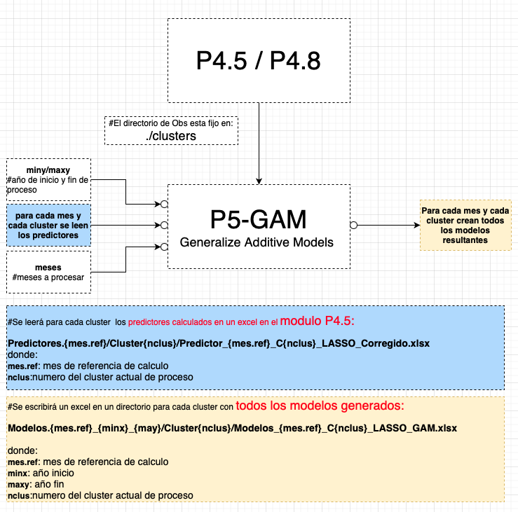

# Pronostico Probabilistico Estadistico (Machine Learning?) 
## Resumen

Se describe la implementacion de un sistema para realizar un pronostico climático (trimestral - bimensual - mensual) en cualquier region de la que se tengan Observaciones provenientes de reanalisis. La implementación de pronósticos de precipitación a escalas mensuales es importante para los tomadores de decisiones en diferentes áreas como la agricultura, la industria y la generación de energía. Dentro de las metodologías de pronóstico de mediana escala se encuentran las técnicas estadísticas que brindan la posibilidad de aprender de situaciones pasadas para pronosticar futuras. Las técnicas de minería de datos son actualmente una herramienta poderosa para abordar estos problemas. En este caso se consideran las redes neuronales, la regresión vectorial de soporte y los modelos aditivos generalizados, además de la metodología de regresión lineal múltiple más utilizada en el pasado, para obtener modelos de predicción de precipitaciones. Los resultados indican que las técnicas de minería de datos mejoran los pronósticos derivados de otras metodologías, aunque la eficiencia de las diferentes metodologías depende en gran medida del mes y la región. Además, la posibilidad de generar ensambles de varios modelos y derivar pronósticos probabilísticos es una alternativa muy recomendable para realizar el pronóstico.        

## Diagrama General 
La figura siguiente muestra la interaccion entre los distintos modulos del sistema de pronostico. 
* Todos los modulos fueron escritos en lenguaje R. 
* Los resultados/salidas en general se escribieron en formato excel. 
      

        

## PASOS (Lenguaje R)
   - ## Preparación de las Observaciones
      * Deben estar dentro del directorio "clusters" en el directorio de trabajo
      * Deben estar contenidas en un archivo excel 
      * Tiene que haber un archivo excel por cada mes
      * Los archivos excel deben llamarse "series.medias.pre.{mes} donde {mes} es 01,02,...12  
      * Como se observa en la figura habra un columna para el año y una columna por cada cluster 
      * Ejemplo de excel con las observaciones de cada cluster
      * Cada columna se debe llamar "cluster1, cluster2, ... clusterN"

      

        
      

      
      :+1: Listo con este Paso !!!
  - ## Preparación de los Reanálisis
      * Los reanalisis deben estar en el directorio **nnr** (ncep-ncar-reanalisis)
      * Son reanalisis de NCEP-NCAR globales 
      * Cuya resolucion es de 144 puntos de longitud por 73 puntos de latitud
      * Esto implica que cubren reticulos de 250x250 Km2
      * La resolucion temporal es mensual
      * Es importante que inicien en el Enero del año 1979 **(aunque el periodo inical en el proceso debe ser 1980!)**
      * las variables de los reanalisis considerados son: 
         *  **hgt200**: geopotencial en 200 hPa
         *  **hgt500**: geopotencial en 200 hPa
         *  **hgt1000**: geopotencial en 1000 hPa,sst
         *  **sst**: temperatura superficie del mar
         *  **tcw**: agua total en la columna
      *  hay una variable que no cambia:
         * **lsm**: mascara de tierra y agua
      * (Explicar el script de descarga y preparacion de estos archivos)

     :+1: Listo con este Paso !!! 
      
   - ## P3-Generación de predictores
      - ### Diagrama de funcionamiento

  

El objetivo de este programa es de obtener regiones cuya correlacion desfasada entre reanalisis y observaciones 
tenga un nivel de correlacion significativa y de ese modo obtener las series de predictores para que sirvan
de entrada al programa de generación de modelos, previa seleccion de aquellos predictores con sentido fisico, que aporten informacion a los modelos generados  

Como se observa en el diagrama de funcionamiento las observaciones estan en el directorio **CLUSTERS** que es un lugar fijo dentro del programa P3 y los renanalisis estan en el directorio **NNR** que tambien es un lugar fijo. y generará mapas de correlacion y por otro lado excels con predictores para el mes considerado.

Importante: 
si queremos pronosticar febrero , correlacionamos los reanalisis de enero con las observaciones de febrero y guardamos los predictores en las planillas excel de febrero con estos predictores se generaran los modelos para febrero.

Ejemplo de archivo excel de predictores:

  

Ejemplo de mapa de correlación:

  

- ## P4-Reduccion de predictores

  

- ## P4.5 y P4.8 -Calculo de predictores siguiente año

  

- ## P5-RLM - Moodelos de regresion lineal multiple 

  

  

- ## P5-SVR - Support Vector Regression 

  

  

- ## P5-GAM - Moodelos de Generalize Additive Models

  

  

- ## P5-ANN - Moodelos de Artificial Neural Networks

  

  

  

